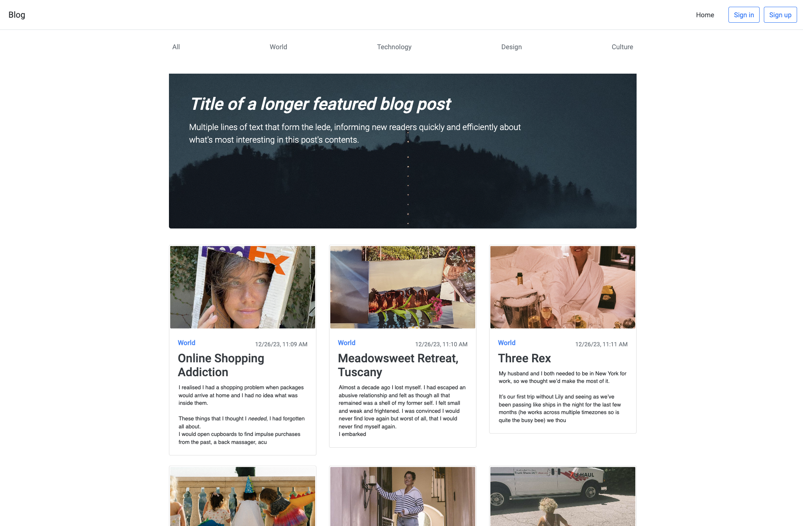
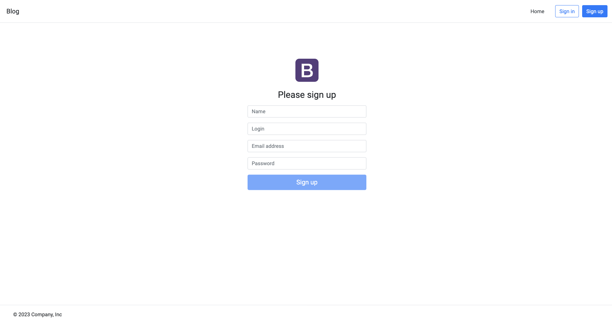
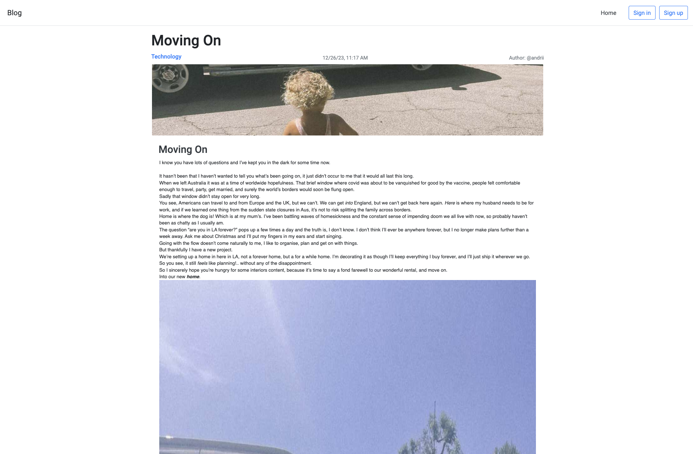
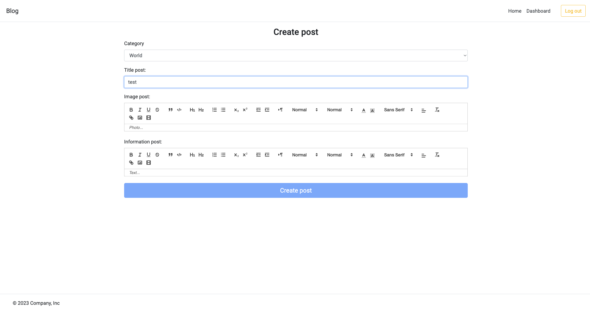

# Blog MEAN

This Angular application, backed by Node.js and Express, utilizes MongoDB for data storage. The primary features include a user-friendly blog interface where users can view and interact with posts. The application incorporates a robust authentication system, allowing users to register, log in, and access personalized content.

## Technologies Used

- **Angular:** The frontend of the application is developed using Angular, providing a dynamic and responsive user interface.

- **Node.js and Express:** The backend is powered by Node.js and Express, enabling efficient server-side processing and handling of requests.

- **MongoDB:** MongoDB is employed as the database to store and manage blog posts, user data, and related information.

- **Passport:** Passport is utilized for user authentication on the backend, ensuring a secure and reliable login system.

- **JWT (JSON Web Tokens):** JWT is implemented for token-based authentication, enhancing security and enabling secure communication between the frontend and backend.

## Features

### Blog Posts

- Users can browse and view a list of blog posts.
- Each post can be accessed individually to read its content and details.

### Categories

- Posts are categorized, allowing users to filter content based on specific topics or themes.

### User Authentication

- User registration and login functionality are implemented on the backend using Node.js.
- Passwords are securely encrypted using Passport, providing a high level of security.
- JWT is used to facilitate token-based authentication, ensuring secure communication between the client and server.

## Setup Instructions

To run the application locally, follow these steps:

## Installation

1. Clone the repository:
   git clone https://github.com/kulakovskyi/angular-blog-MEAN

2. Install backend dependencies:
   cd back-end
   npm install

3. Run the backend server with nodemon:
   cd back-end
   nodemon

4. Install frontend dependencies:
   cd front-end
   npm install

5. Start the frontend application:
   cd front-end
   ng serve

6. Ensure the MongoDB database is running:
   brew services start mongodb/brew/mongodb-community

## Screenshots

## Contribution

Your contributions are welcome! If you have suggestions to enhance the project or if you've encountered a bug, feel free to create an issue or submit a pull request.

## License

This project is licensed under the MIT License. See the [LICENSE.md](LICENSE.md). file for more information.